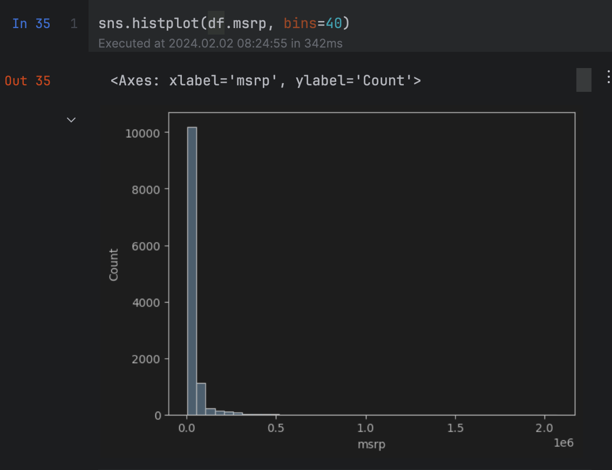
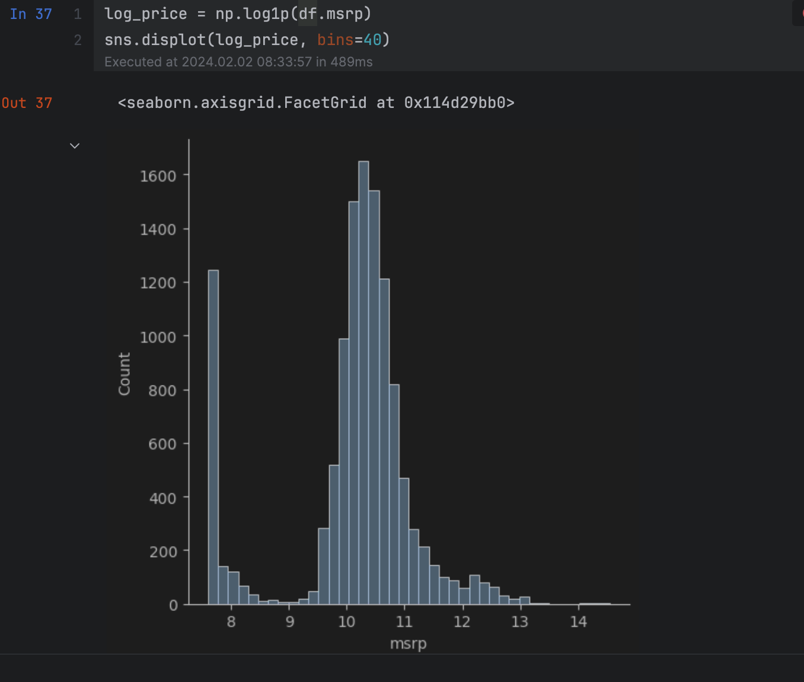

# Car Price Prediction
## Tech Stack
* Python
* Numpy
* Seaborn
* Pandas
* Jupyter Notebook
## Introduction 
This problem is a prominent problem from Kaggle. Kaggle provided a dataset that is dirty or unsuitable.
Problem solvers are to clean the data and from various inferences make a predictions of what a car price would be 
in the market.
## My Methods
First, I cleaned the data up by making sure the title names are consistent with each other. Then in cases where values are 
not given or values are indicated by the "-" sign I filled it in with a zero as the problem is a Regression problem.

Secondly, I divided my dataset into testing, validation and training batches. Using only the training batch which has 60% 
of the data I converted them in to a pandas dataframe. Furthermore, I inspected the dataset for inconsistencies to which I found 
long tails(as seen in the first image) that can cause the model confusion. I made the need correction to handle long tails by using the log function
to get more detail into the dataset(as represented in image 2). This correction enhances the data so that the element unseen in the former data representation
could now be uncovered and explored. I made use of the linear regression algorithm to train the model on the training data, and get weights to pass as weights for
test and validation.

Finally, to train the data I implemented the RMSE to give me the confidence of the model as opposed to the plotting diagrams each time.

Note: The train, tests, and validation were all done in isolation of each other.

## Conclusion
I was a able to achieve 80 percent accuracy in predicting price targets(image 3). With more feature engineer the prediction accuracy can
produce and increase in the accuracy of the model.
## Images
image 1 
image 2 
image 3 
## Resources
* [Kaggle](https://www.kaggle.com/datasets/CooperUnion/cardataset)
## Author
[Burmau Garba](https://github.com/BURMAUG)
